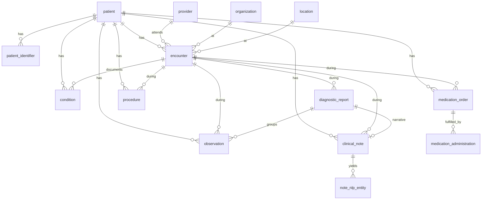

# Generic Clinical Data Model — Synthetic EHR POC

> FHIR-aligned, source-agnostic model on Databricks (Unity Catalog + Delta Lake).
> Synaptiq — Data Architecture.

A **source-agnostic, FHIR-aligned** data model that can house synthetic clinical data
conformed from **Epic (Clarity / Epic-on-FHIR)** and **athenahealth (athenaNet / FHIR
R4)**, purpose-built to support **NLP-based patient cohort building**.

Companion to [`ehr-source-schemas.md`](./ehr-source-schemas.md) (the source-system
research). DDL lives in [`../ddl/`](../ddl/).

- **Target platform:** Databricks — Unity Catalog (3-level namespace) + Delta Lake
- **Paradigm:** custom tables loosely mapped to FHIR R4 resources, simplified for a POC
- **Centerpiece:** a first-class `clinical_note` table plus an `nlp` schema that links
  NLP-extracted entities back to structured concepts for cohort logic

---

## 1. Design principles

1. **One conformed model, many sources.** Epic and athena differ wildly at the source
   (SQL tables vs FHIR resources), but both normalize to the same standard codings
   (ICD-10-CM, RxNorm/NDC, LOINC, CPT/HCPCS, SNOMED CT). The generic model targets those
   standards so a cohort query is written **once**, regardless of origin.
2. **FHIR-aligned, not FHIR-literal.** Tables echo FHIR resource shapes (`patient`,
   `encounter`, `condition`, `observation`, `procedure`, `medication_*`,
   `clinical_note` ≈ DocumentReference) but are flattened relational tables — no nested
   FHIR JSON gymnastics required to query them. Original payloads are retained in bronze.
3. **Provenance on every row.** Every conformed row carries `source_system`,
   `source_id`, and load metadata so we can trace any cohort member back to the exact
   Epic table row or athena resource.
4. **Unstructured text is a first-class citizen.** `clinical_note` holds the full,
   reassembled note body (Epic: `HNO_NOTE_TEXT` concatenated by `LINE`; athena:
   `Binary`/attachment decoded, OCR'd if scanned). NLP output is structured into
   `nlp.note_nlp_entity` and joins to the same patient/encounter keys as the structured
   domains — so a cohort can be defined from coded data, NLP-derived data, or both.
5. **Medallion architecture.** `bronze` (raw, as-ingested) → `silver` (conformed generic
   model — the heart of this doc) → `gold` (cohort & feature marts). Plus cross-cutting
   `terminology` (vocab/crosswalks) and `nlp` (extraction outputs) schemas.
6. **Databricks-native.** Delta tables; **informational** `PRIMARY KEY`/`FOREIGN KEY`
   constraints (`NOT ENFORCED ... RELY`) for documentation + query optimization;
   `GENERATED BY DEFAULT AS IDENTITY` surrogate keys; **liquid clustering** (`CLUSTER BY`)
   instead of partitioning; `VARIANT` for raw semi-structured payloads.

---

## 2. Architecture — Unity Catalog layout

Catalog: **`ehr_poc`**

| Schema | Layer | Purpose | Key tables |
|---|---|---|---|
| **`bronze`** | Raw | As-ingested source data, untyped/semi-structured | `raw_fhir_resource`, `raw_clarity_extract` |
| **`terminology`** | Reference | Standard vocabularies & crosswalks | `code_system`, `concept` |
| **`silver`** | Conformed | **The generic clinical model** (8 domains + supporting) | `patient`, `encounter`, `condition`, `observation`, `medication_order`, `medication_administration`, `procedure`, `clinical_note`, … |
| **`nlp`** | Derived | NLP run metadata + extracted entities from notes | `nlp_run`, `note_nlp_entity` |
| **`gold`** | Marts | Cohort definitions, membership, patient feature tables | `cohort_definition`, `cohort_member`, `patient_feature` |

```
ehr_poc
├── bronze        (raw FHIR resources + Clarity extracts, VARIANT payloads)
├── terminology   (code_system, concept crosswalks: ICD-10/RxNorm/LOINC/CPT/SNOMED)
├── silver        (conformed generic clinical model  ← primary deliverable)
├── nlp           (nlp_run, note_nlp_entity)
└── gold          (cohort_definition, cohort_member, patient_feature)
```

**Data flow:** Epic Clarity SQL extracts and Epic/athena FHIR Bulk `$export` NDJSON land
in `bronze` → conform/standardize into `silver` → run NLP over `silver.clinical_note`,
write `nlp.note_nlp_entity` → assemble cohorts in `gold`.

---

## 3. Conventions

**Keys**
- Every silver table has a **surrogate PK** `*_sk` (`BIGINT GENERATED BY DEFAULT AS
  IDENTITY`). FKs reference these surrogates.
- Every table also stores the **business key**: `source_system` + `source_id` (the
  original Epic ID or athena/FHIR resource id). ETL resolves FKs by looking up the
  business key. A unique informational constraint documents `(source_system, source_id)`.
- Constraints are **informational only** (`NOT ENFORCED`, `RELY`). Databricks does not
  enforce them at write time — they document intent and let the optimizer use them. **The
  ETL layer is responsible for referential integrity.**

**Provenance / audit columns** (on every silver/nlp/gold row)
| Column | Type | Meaning |
|---|---|---|
| `source_system` | STRING | `epic` \| `athena` \| `synthea` (synthetic generator) |
| `source_id` | STRING | original key (Epic `PAT_ID`, athena `patientid`, FHIR resource id) |
| `source_table_or_resource` | STRING | e.g. `PAT_ENC`, `Condition` |
| `ingested_at` | TIMESTAMP | bronze landing time |
| `loaded_at` | TIMESTAMP | silver conform time |
| `raw_payload` | VARIANT | optional pointer to / copy of the source record |

**Coding pattern (used wherever a clinical code appears)**
A repeating trio of columns instead of a hard FK to a giant vocab table:
- `*_code` (STRING) — the code value, e.g. `E11.9`
- `*_system` (STRING) — the code system, e.g. `ICD-10-CM`, `RxNorm`, `LOINC`, `CPT`, `SNOMED`
- `*_display` (STRING) — human-readable text
Optionally `*_concept_sk` FK into `terminology.concept` once vocabularies are loaded.

**Naming:** `snake_case`; datetimes are `TIMESTAMP` (UTC); enumerated status fields are
STRING with a documented value set (and an optional `CHECK` constraint).

---

## 4. The generic clinical model (`silver`) — by domain

### Entity-relationship overview



### Supporting / reference tables

| Table | Role | Notable columns |
|---|---|---|
| **`patient_identifier`** | Identity resolution — the crux of multi-source loading | `patient_sk`, `identifier_type` (MRN / enterprise_id / source_pat_id / SSN-last4 / member_id), `identifier_value`, `assigning_authority`, `source_system` |
| **`provider`** | FHIR Practitioner | `provider_sk`, `npi`, `full_name`, `specialty`, source keys |
| **`organization`** | FHIR Organization (facility / practice) | `organization_sk`, `name`, `type`, athena `practiceid` mapping |
| **`location`** | FHIR Location (department / unit / room) | `location_sk`, `name`, `type`, `organization_sk` |

> **Why `patient_identifier` matters:** Epic uses a lifelong internal `PAT_ID` plus a
> visible `PAT_MRN_ID` (and many IDs in `IDENTITY_ID`); athena's `patientid` is
> **practice-scoped** and MRN is often a *custom field*, with an Enterprise ID linking
> across practices. A patient appearing in both systems gets **one** `patient_sk` and
> multiple `patient_identifier` rows. This table is how cross-source dedup/linkage works.

### Domain 1 — Patient Demographics → `patient`

| Column | Type | Notes |
|---|---|---|
| `patient_sk` | BIGINT IDENTITY (PK) | surrogate |
| `source_system`, `source_id` | STRING | Epic `PAT_ID` / athena `patientid` |
| `mrn` | STRING | convenience copy of primary MRN (full set in `patient_identifier`) |
| `birth_date` | DATE | |
| `sex` | STRING | administrative sex (`male`/`female`/`other`/`unknown`) |
| `gender_identity`, `race`, `ethnicity` | STRING | USCDI demographics |
| `deceased_flag`, `deceased_date` | BOOLEAN, DATE | |
| `address_*`, `city`, `state`, `zip` | STRING | |
| `primary_language`, `marital_status` | STRING | |
| + audit/provenance cols | | |

- **Epic source:** `PATIENT` / `PATIENT_2..4`, `PATIENT_RACE`, `IDENTITY_ID`
- **athena source:** `Patient` FHIR / `GET /patients/{id}`

### Domain 2 — Encounters/Visits → `encounter`

| Column | Type | Notes |
|---|---|---|
| `encounter_sk` | BIGINT IDENTITY (PK) | |
| `patient_sk` | BIGINT (FK) | |
| `source_system`, `source_id` | STRING | Epic `PAT_ENC_CSN_ID` / athena Encounter id |
| `encounter_class` | STRING | `inpatient` / `outpatient` / `emergency` / `ambulatory` / `telehealth` |
| `encounter_type_code/_system/_display` | STRING | visit type |
| `status` | STRING | `planned`/`arrived`/`in-progress`/`finished`/`cancelled` |
| `period_start`, `period_end` | TIMESTAMP | |
| `admit_source`, `discharge_disposition` | STRING | inpatient ADT |
| `attending_provider_sk` | BIGINT (FK) | |
| `organization_sk`, `location_sk` | BIGINT (FK) | |
| `hospital_account_id` | STRING | Epic HAR linkage |

- **Epic source:** `PAT_ENC`, `PAT_ENC_HSP`, `CLARITY_ADT`, `HSP_ACCOUNT`
- **athena source:** `Encounter` FHIR (+ `Appointment` for scheduling). **Note: in athena,
  Appointment ≠ Encounter** — only checked-in/clinical visits become encounters here.

### Domain 3 — Clinical Notes → `clinical_note` ⭐ (NLP centerpiece)

| Column | Type | Notes |
|---|---|---|
| `note_sk` | BIGINT IDENTITY (PK) | |
| `patient_sk`, `encounter_sk` | BIGINT (FK) | |
| `source_system`, `source_id` | STRING | Epic `NOTE_ID`(+`NOTE_CSN_ID`) / athena DocumentReference id |
| `note_type_code/_system/_display` | STRING | LOINC document type; e.g. Discharge Summary, Progress Note, H&P, Consult, **Pathology Report**, Radiology Report |
| `note_category` | STRING | `discharge_summary`/`progress`/`hp`/`consult`/`pathology`/`radiology`/`other` |
| `author_provider_sk` | BIGINT (FK) | |
| `service_date`, `created_at`, `signed_at` | TIMESTAMP | |
| `status` | STRING | `preliminary`/`signed`/`addended` |
| **`note_text`** | **STRING** | **full reassembled plain text — the NLP input** |
| `content_type` | STRING | `text/plain`/`text/html`/`application/pdf` (original) |
| `text_extraction_method` | STRING | `structured_text` / `html_stripped` / `ocr` / `pdf_extract` — **NLP data-quality signal** |
| `text_char_length` | INT | |
| `raw_payload` | VARIANT | original DocumentReference/Binary or HNO rows |

**Provenance of the text matters for NLP quality:**
- **Epic** notes → already clean structured text (concatenate `HNO_NOTE_TEXT` by `LINE`)
  → `text_extraction_method = 'structured_text'`. Path/rad narratives from
  `ORDER_RESULTS`/result comments map here too (or via `diagnostic_report`).
- **athena** notes → `DocumentReference` → `Binary`; branch on `content_type`:
  plain/HTML → strip; PDF → text extract; **scanned/faxed image → OCR** (flagged so NLP
  can down-weight noisy OCR output).

> A `diagnostic_report` row (below) can point to a `clinical_note` for its narrative,
> tying a structured pathology/lab report to its free-text body.

### Domain 4 — Diagnoses → `condition`

| Column | Type | Notes |
|---|---|---|
| `condition_sk` | BIGINT IDENTITY (PK) | |
| `patient_sk`, `encounter_sk` | BIGINT (FK) | encounter nullable for problem-list items |
| `category` | STRING | **`problem-list-item`** vs **`encounter-diagnosis`** |
| `condition_code/_system/_display` | STRING | **ICD-10-CM** (and/or SNOMED) |
| `clinical_status` | STRING | `active`/`resolved`/`inactive` |
| `verification_status` | STRING | `confirmed`/`provisional` |
| `rank` | INT | 1 = primary dx |
| `onset_date`, `recorded_date`, `resolved_date` | DATE | |
| `is_chronic`, `is_primary` | BOOLEAN | |

- **Epic source:** `PAT_ENC_DX` + `PROBLEM_LIST` → `CLARITY_EDG`/`EDG_CURRENT_ICD10`;
  billing dx from `HSP_ACCT_DX_LIST`. **Guard against `DX_ID`↔ICD many-to-many fan-out.**
- **athena source:** `Condition` FHIR (`category` distinguishes problem vs encounter-dx).

### Domain 5 — Medications → `medication_order` + `medication_administration`

`medication_order` (orders / prescriptions — FHIR MedicationRequest):

| Column | Type | Notes |
|---|---|---|
| `med_order_sk` | BIGINT IDENTITY (PK) | |
| `patient_sk`, `encounter_sk`, `ordering_provider_sk` | BIGINT (FK) | |
| `med_code/_system/_display` | STRING | **RxNorm** (+ `ndc_code`) |
| `order_class` | STRING | `inpatient` / `outpatient`(prescription) |
| `dose_quantity`, `dose_unit`, `route`, `frequency` | STRING/DOUBLE | |
| `sig_text` | STRING | free-text instructions (minor NLP target) |
| `order_status` | STRING | `active`/`completed`/`discontinued` |
| `start_datetime`, `end_datetime` | TIMESTAMP | |

`medication_administration` (MAR — what was actually given; FHIR MedicationAdministration):

| Column | Type | Notes |
|---|---|---|
| `med_admin_sk` | BIGINT IDENTITY (PK) | |
| `med_order_sk`, `patient_sk`, `encounter_sk` | BIGINT (FK) | |
| `admin_datetime`, `scheduled_datetime` | TIMESTAMP | |
| `admin_action` | STRING | `given`/`held`/`refused` |
| `dose_given`, `dose_unit`, `route`, `infusion_rate` | DOUBLE/STRING | |

- **Epic source:** `ORDER_MED` (+ `CLARITY_MEDICATION`, RxNorm crosswalks) →
  `medication_order`; `MAR_ADMIN_INFO` → `medication_administration`.
- **athena source:** `MedicationRequest`/`MedicationStatement` (+ `MedicationAdministration`).

### Domain 6 — Lab Results → `observation` (category `laboratory`) + `diagnostic_report`

We use **one `observation` table** for labs **and** vitals (FHIR uses `Observation` for
both), discriminated by `category`. `diagnostic_report` groups results into a panel/report.

`observation`:

| Column | Type | Notes |
|---|---|---|
| `observation_sk` | BIGINT IDENTITY (PK) | |
| `patient_sk`, `encounter_sk` | BIGINT (FK) | |
| `diagnostic_report_sk` | BIGINT (FK, nullable) | groups lab panels |
| `category` | STRING | **`laboratory`** / **`vital-signs`** |
| `observation_code/_system/_display` | STRING | **LOINC** |
| `value_numeric` | DOUBLE | |
| `value_string` | STRING | non-numeric / coded results |
| `unit` | STRING | UCUM |
| `reference_range_low/_high` | DOUBLE | |
| `interpretation` | STRING | `normal`/`high`/`low`/`critical`/`abnormal` |
| `effective_datetime` | TIMESTAMP | |
| `parent_observation_sk` | BIGINT (FK, nullable) | for components (e.g. BP → systolic/diastolic) |

`diagnostic_report` (FHIR DiagnosticReport — also the bridge to narrative text):

| Column | Type | Notes |
|---|---|---|
| `diagnostic_report_sk` | BIGINT IDENTITY (PK) | |
| `patient_sk`, `encounter_sk` | BIGINT (FK) | |
| `report_code/_system/_display` | STRING | LOINC panel / report type |
| `report_category` | STRING | `LAB`/`PATHOLOGY`/`RADIOLOGY`/`MICRO` |
| `status`, `effective_datetime` | STRING/TIMESTAMP | |
| `narrative_note_sk` | BIGINT (FK → `clinical_note`) | path/rad **free-text** body |

- **Epic source:** `ORDER_PROC` (order) + `ORDER_RESULTS` (`ORD_VALUE`/`ORD_NUM_VALUE`,
  reference ranges, `RESULT_FLAG_C`) → `CLARITY_COMPONENT`/`LNC_DB_MAIN` for LOINC.
- **athena source:** `Observation[laboratory]` + `DiagnosticReport` (+ `ServiceRequest`,
  `Specimen`).

### Domain 7 — Procedures → `procedure`

| Column | Type | Notes |
|---|---|---|
| `procedure_sk` | BIGINT IDENTITY (PK) | |
| `patient_sk`, `encounter_sk`, `performer_provider_sk` | BIGINT (FK) | |
| `procedure_code/_system/_display` | STRING | **CPT/HCPCS** (and/or SNOMED) |
| `procedure_category` | STRING | `surgical`/`diagnostic`/`therapeutic` |
| `status` | STRING | `completed`/`in-progress` |
| `performed_datetime`, `performed_period_end` | TIMESTAMP | |
| `modifier_1..4` | STRING | billing modifiers |
| `is_billed` | BOOLEAN | clinical vs billed distinction |

- **Epic source:** `ORDER_PROC` → `CLARITY_EAP.PROC_CODE`; billed CPT from
  `ARPB_TRANSACTIONS` / `HSP_ACCT_*`; OR cases from `OR_LOG`.
- **athena source:** `Procedure` FHIR (+ custom `Charge`/`Claim` for billed).

### Domain 8 — Vital Signs → `observation` (category `vital-signs`)

Reuses the `observation` table with `category = 'vital-signs'`. Common LOINC rows:
height (8302-2), weight (29463-7), BMI (39156-5), heart rate (8867-4), temp (8310-5),
SpO2 (59408-5), and **blood pressure** as a parent observation (85354-9) with two
component children — **systolic (8480-6)** and **diastolic (8462-4)** — linked via
`parent_observation_sk`.

- **Epic source:** flowsheets `IP_FLWSHT_MEAS` → `IP_FLO_GP_DATA` (BP stored as one
  `120/80` string → **split into two component rows on load**).
- **athena source:** `Observation[vital-signs]` (BP already as components).

---

## 5. NLP layer (`nlp`)

This is what makes the model NLP-cohort-ready: extracted entities from `clinical_note`
land in a structured table keyed to the same patient/encounter, so unstructured findings
participate in cohort logic exactly like coded data.

**`nlp.nlp_run`** — one row per pipeline execution (reproducibility / model versioning):
`nlp_run_sk`, `model_name`, `model_version`, `pipeline_config` (VARIANT), `run_started_at`,
`run_finished_at`, `note_count`.

**`nlp.note_nlp_entity`** — one row per extracted mention:

| Column | Type | Notes |
|---|---|---|
| `entity_sk` | BIGINT IDENTITY (PK) | |
| `note_sk` | BIGINT (FK → `silver.clinical_note`) | |
| `patient_sk`, `encounter_sk` | BIGINT (FK) | denormalized for fast cohort joins |
| `nlp_run_sk` | BIGINT (FK) | |
| `entity_type` | STRING | `problem`/`medication`/`lab`/`procedure`/`anatomy`/`finding` |
| `covered_text` | STRING | the literal span |
| `span_start`, `span_end` | INT | char offsets into `note_text` |
| `concept_code/_system/_display` | STRING | normalized to **SNOMED/RxNorm/ICD-10/LOINC** |
| `negation` | BOOLEAN | "no evidence of pneumonia" |
| `certainty` | STRING | `positive`/`negated`/`uncertain`/`hypothetical` |
| `temporality` | STRING | `current`/`historical`/`family` |
| `subject` | STRING | `patient`/`family`/`other` |
| `confidence` | DOUBLE | model score |

> **Why negation/temporality/subject are explicit columns:** a naïve keyword cohort
> ("patients whose notes mention diabetes") is wrong — it catches *"no diabetes"*,
> *"family history of diabetes"*, *"rule out diabetes"*. These attributes (the classic
> NegEx/ConText features) are what make NLP-derived cohorts trustworthy.

---

## 6. Cohort & feature layer (`gold`)

**`gold.cohort_definition`** — `cohort_sk`, `name`, `description`, `definition_logic`
(SQL/JSON text), `created_by`, `created_at`, `is_nlp_derived` (BOOLEAN).

**`gold.cohort_member`** — `cohort_sk`, `patient_sk`, `qualified_at`,
`qualifying_source` (`coded`/`nlp`/`both`), `qualifying_evidence` (VARIANT — e.g. the
condition or note_nlp_entity rows that triggered inclusion). This dual-source provenance
is the payoff of the whole design: you can show **why** each patient is in the cohort and
whether it came from structured codes, NLP, or both.

**`gold.patient_feature`** (optional) — a wide, one-row-per-patient feature table for
downstream ML (age, sex, dx flags, last labs, note-derived findings), assembled from
silver + nlp.

---

## 7. Terminology (`terminology`)

Lightweight for the POC — the inline `*_code/_system/_display` trio means we are **not**
blocked on loading full vocabularies.

- **`terminology.code_system`** — registry of systems (`ICD-10-CM`, `RxNorm`, `LOINC`,
  `CPT`, `HCPCS`, `SNOMED`) with version/URI.
- **`terminology.concept`** — `concept_sk`, `code_system`, `code`, `display`,
  `concept_class`, plus optional crosswalk (`maps_to_snomed`). Populate incrementally;
  silver `*_concept_sk` columns can link here once loaded.

---

## 8. Bronze landing (`bronze`)

- **`bronze.raw_fhir_resource`** — `resource_type`, `resource_id`, `source_system`,
  `payload VARIANT` (the raw FHIR JSON), `bundle_id`, `ingested_at`. One generic table for
  all athena/Epic FHIR `$export` NDJSON.
- **`bronze.raw_clarity_extract`** — `source_table` (e.g. `PAT_ENC`), `natural_key`,
  `payload VARIANT`, `extract_batch_id`, `ingested_at`. Generic landing for Clarity SQL pulls.

Keeping raw payloads means we can re-conform silver without re-extracting from the source,
and we can always recover a field we didn't model yet.

---

## 9. How each source loads in (traceability to the research)

| Generic table | Epic Clarity origin | athenahealth origin |
|---|---|---|
| `patient` | `PATIENT`, `PATIENT_2..4`, `PATIENT_RACE`, `IDENTITY_ID` | `Patient` FHIR / `/patients` |
| `patient_identifier` | `IDENTITY_ID`, `PAT_MRN_ID` | `Patient.identifier[]`, Enterprise ID, MRN custom field |
| `encounter` | `PAT_ENC`, `PAT_ENC_HSP`, `CLARITY_ADT`, `HSP_ACCOUNT` | `Encounter` (+ `Appointment`) |
| `clinical_note` | `HNO_INFO` + `HNO_NOTE_TEXT` (concat by `LINE`); result narratives | `DocumentReference` + `Binary` (PDF/HTML/OCR) |
| `condition` | `PAT_ENC_DX`, `PROBLEM_LIST` → `EDG_CURRENT_ICD10`; `HSP_ACCT_DX_LIST` | `Condition` |
| `medication_order` | `ORDER_MED` → `CLARITY_MEDICATION` + RxNorm crosswalk | `MedicationRequest`/`MedicationStatement` |
| `medication_administration` | `MAR_ADMIN_INFO` | `MedicationAdministration` |
| `observation` (lab) | `ORDER_PROC` + `ORDER_RESULTS` → `CLARITY_COMPONENT`/LOINC | `Observation[laboratory]` |
| `diagnostic_report` | `ORDER_PROC` + result comments | `DiagnosticReport` |
| `procedure` | `ORDER_PROC` → `CLARITY_EAP`; `ARPB_TRANSACTIONS` | `Procedure` (+ Charge/Claim) |
| `observation` (vital) | `IP_FLWSHT_MEAS` → `IP_FLO_GP_DATA` | `Observation[vital-signs]` |

---

## 10. POC scope notes

**In scope:** the 8 domains, identity resolution, NLP entity extraction + linkage,
cohort assembly with dual (coded/NLP) provenance.

**Deferred (easy to add later):** allergies (`AllergyIntolerance`), immunizations,
care plans/goals, family history, insurance/claims financials, social determinants,
full vocabulary loads, slowly-changing-dimension history on `patient`.

**Synthetic data:** the model is generator-agnostic. **Synthea** (set `source_system =
'synthea'`) is the fastest way to populate `silver` with FHIR R4 directly; hand-authored
synthetic notes can be injected into `clinical_note` to exercise the NLP path
(including deliberately noisy/OCR-style text and negation/temporality cases).

**Recommended Databricks practices:**
- Liquid clustering (`CLUSTER BY`) on `patient_sk` (+ a date) for the large event tables.
- Keep `note_text` in-row for the POC; if notes get huge, store text in a volume and keep
  a path — but in-row Delta is fine at POC scale and simplest for NLP jobs.
- `VARIANT` columns require DBR 15.3+; fall back to `STRING` (JSON) on older runtimes.
- Constraints are informational — **validate referential integrity in ETL/tests**, not by
  relying on the engine.

---

## 11. DDL

Runnable Databricks SQL in [`../ddl/`](../ddl/), run in order:

1. `01_catalog_and_schemas.sql` — catalog + 5 schemas
2. `02_terminology.sql` — `code_system`, `concept`
3. `03_silver_clinical_model.sql` — the conformed 8-domain model + supporting tables
4. `04_nlp.sql` — `nlp_run`, `note_nlp_entity`
5. `05_gold_cohort.sql` — `cohort_definition`, `cohort_member`, `patient_feature`
6. `06_bronze_landing.sql` — raw FHIR / Clarity landing tables
